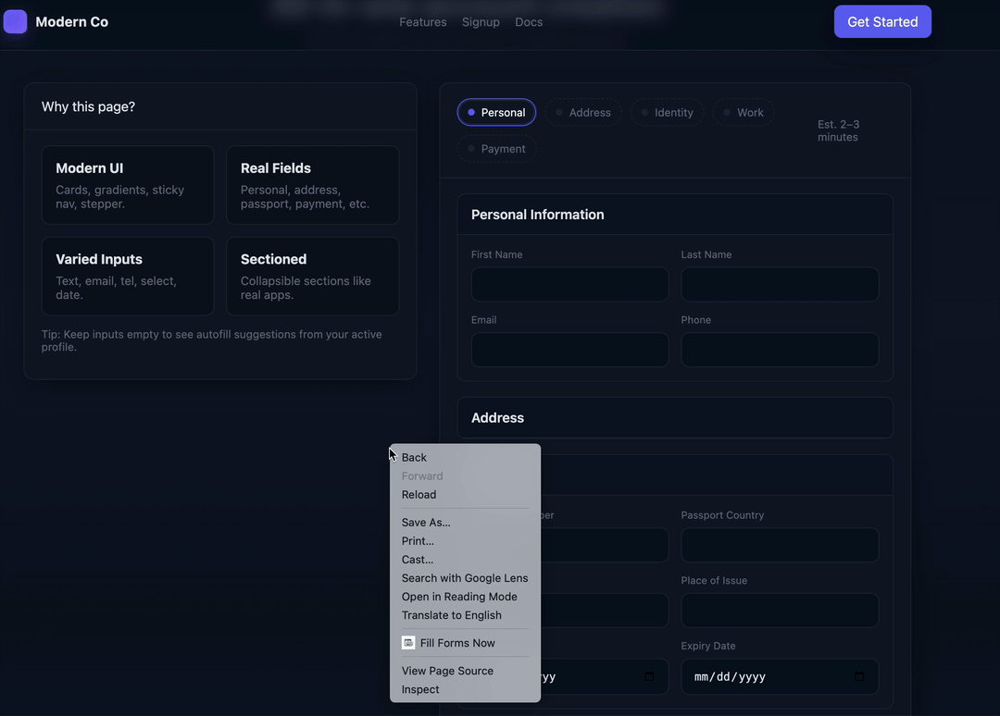
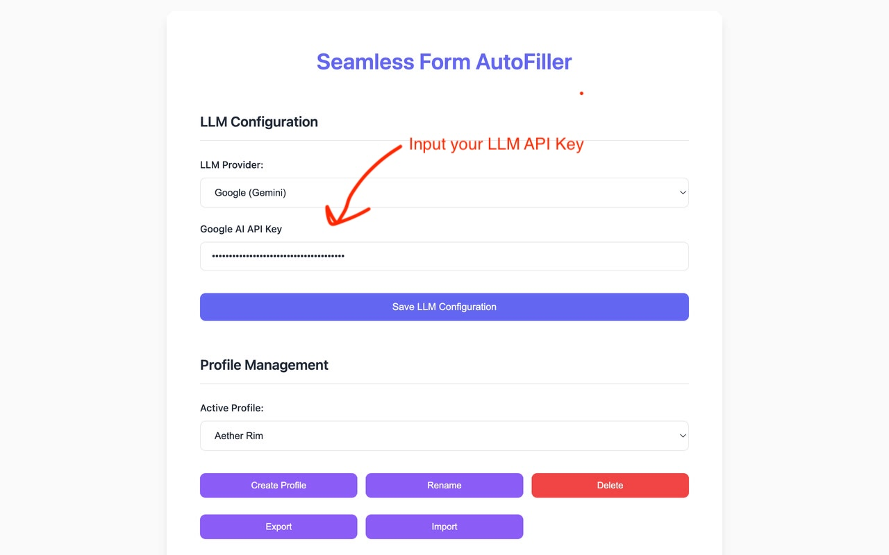
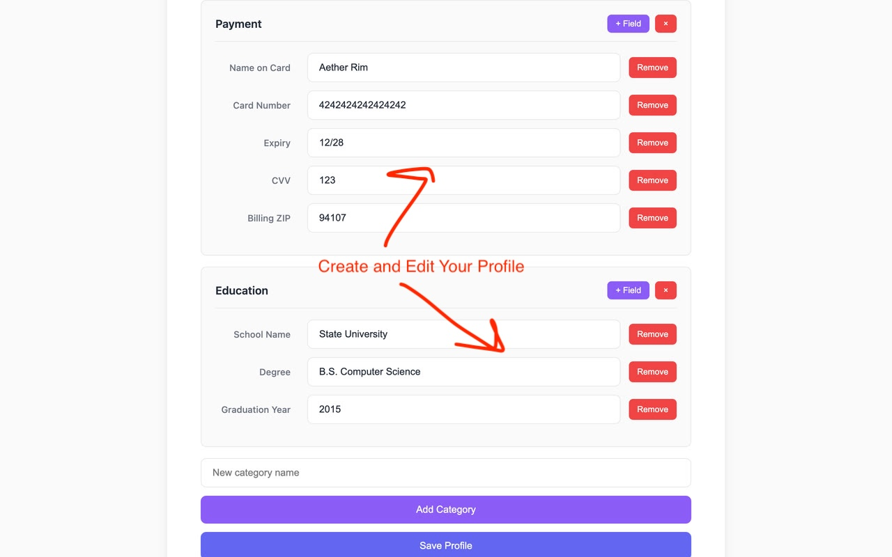
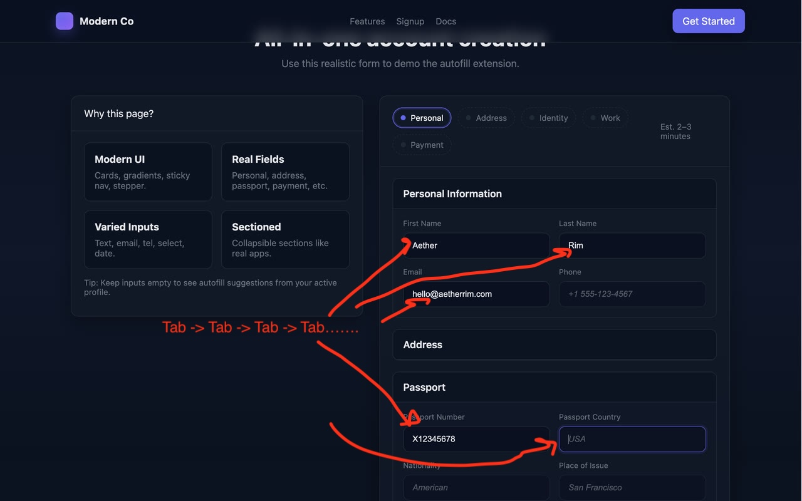
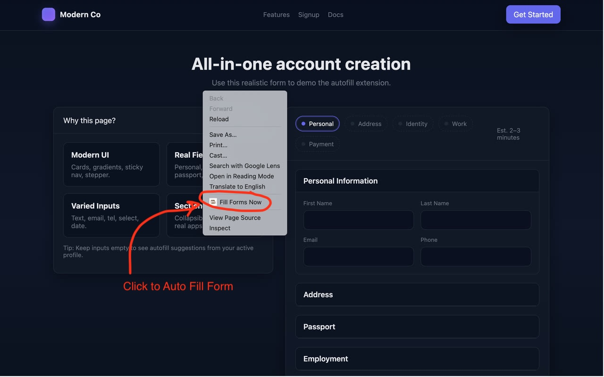

# Seamless Form AutoFiller Chrome Extension

A powerful Chrome extension that uses Large Language Models to detect and suggest completions for web forms with intelligently organized profile data. Features multiple profile management, categorized data organization, and seamless form detection with tab‑key confirmation for enhanced productivity.



## What's New 🚀

- ⚡ Auto‑fill with Tab confirmation: suggestions appear; press Tab to accept
- 🖱️ Right‑click trigger: one‑time “Fill Forms Now” on the current page
- 📂 Profile categories: organize data (Personal, Address, Passport, etc.)
- 👥 Multiple profiles: separate profiles for work, personal, travel
- 🧩 Simplified field management: enter names; keys auto‑generated
- 🔄 Smart profile switching: quick dropdown between contexts

## Features

- 🤖 LLM‑powered field mapping: understands form fields and maps to your profile
- 🔒 Privacy‑first: personal data stays local; only form structure sent to LLMs
- 📝 Automatic form detection: detects `<form>` and form‑like containers
- ⚡ Tab‑to‑accept: suggestions shown; press Tab to fill and advance
- 🖱️ Right‑click trigger: run “Fill Forms Now” on the current page
- 📂 Organized categories: Personal, Address, Passport, and custom
- 👥 Multiple profiles: create, switch, import/export

## Installation

### Prerequisites
- Node.js (v16 or higher)
- npm or yarn

### Build Instructions

1. **Clone and install dependencies:**
   ```bash
   cd form_auto_fill
   npm install
   ```

2. **Build the extension:**
   ```bash
   npm run build
   ```

3. **Load in Chrome:**
   - Open Chrome and go to `chrome://extensions/`
   - Enable "Developer mode" (top right toggle)
   - Click "Load unpacked"
   - Select the `form_auto_fill` directory

## Setup

1. **Configure LLM API:**
   - Click the extension icon in Chrome toolbar
   - Choose provider (OpenAI, Anthropic, Google)
   - Enter your API key
   - Click "Save LLM Configuration"

   

2. **Run Auto‑Fill (via right‑click):**
   - Right‑click any page and choose "Fill Forms Now"
   - This injects the content script once for the current tab

3. **Set up your profile:**
   - **Create a Profile**: Click "Create Profile" and give it a name (e.g., "Work", "Personal", "Travel")
   - **Organize Your Data**: Your profile comes with pre-organized categories:
     - **Personal Information**: Name, email, phone
     - **Address**: Complete address details
     - **Passport**: Passport number, nationality, issue details
   - **Add Custom Fields**: Click "+ Field" within any category and enter just the field name
   - **Add Custom Categories**: Create new categories for specific use cases
   - **Switch Profiles**: Use the dropdown to switch between different profiles
   - Click "Save Profile" to store your changes
   
   

## Usage

1. **Navigate to any web page with forms**
2. After triggering, **auto‑fill suggestions appear** as gray placeholder text
3. **Press Tab to accept** and move to the next field
4. **Continue pressing Tab** to accept additional suggestions or type to override them
5. **Submit the form** when you're satisfied with the filled data

   

### Triggering

- Right‑click page → "Fill Forms Now" to run a one‑time fill on the current tab
- Re‑run the action on new pages or after significant page changes if needed



## How It Works

1. **Activation**: When you choose "Fill Forms Now", the content script is injected into the current tab and performs a one‑time pass (with a short dynamic observer window)
2. **LLM Analysis**: When a form is detected, its HTML structure (without values) is sent to the selected LLM for analysis
3. **Field Mapping**: The LLM returns a mapping of form fields to your active profile's field keys
4. **Suggestion Display**: Matching profile data appears as gray placeholder text in form fields
5. **Tab Confirmation**: Press **Tab** to accept a suggestion, which fills the field and moves focus to the next input
6. **Smart Navigation**: The system automatically moves focus to the next relevant field after each acceptance

## Profile Management

The extension supports multiple profiles with organized categories for better data management:

### Creating Profiles
- Click "Create Profile" to make a new profile
- Give it a descriptive name (e.g., "Work", "Personal", "Travel")
- Each profile comes with pre-built categories


### Organizing Data
- **Personal Information**: Basic details like name, email, phone
- **Address**: Complete address information
- **Passport**: Travel document details
- **Custom Categories**: Create your own categories for specific needs

### Managing Fields
- Add fields by clicking "+ Field" within any category
- Simply enter the field name - the system auto-generates the internal field key
- Remove fields or categories as needed
- All changes are automatically saved

### Switching Profiles
- Use the dropdown in the extension settings to switch between profiles
- Each profile maintains its own data independently
- Perfect for different contexts (work vs personal vs travel)

### Export/Import Profiles
- Export: Click "Export" in Profile Management to download the active profile as JSON
- Import: Click "Import" and select a JSON file to create a new profile
- Supported formats:
  - Current format with categories and fields
  - Legacy flat key/value JSON (will be placed under an "Imported" category)
- The imported profile is saved as a new profile; you can rename it during import.

## Privacy & Security

- ✅ Personal data never leaves your device — stored in Chrome local storage
- ✅ Only form structure sent to LLM — no personal values or user‑entered data
- ✅ On‑demand only — trigger via right‑click; no persistent on/off state
- ✅ Tab confirmation required — no silent filling
- ✅ One‑shot injection — content script runs briefly and stops

## Development

### Project Structure

```
src/
├── background.ts        # Service worker: LLM calls, profiles, context menu action, injection
├── content.ts           # Content script: form detection/filling, one‑shot run
├── settings.ts          # Options UI: LLM configuration and profile management
├── types.ts             # Type definitions (profiles, categories, LLM config)
├── form-filler.ts       # Form filling logic with profile compatibility
└── llm/
    ├── provider-factory.ts        # Chooses provider (OpenAI/Anthropic/Google)
    └── providers/
        ├── openai.ts              # OpenAI integration
        ├── anthropic.ts           # Anthropic integration
        └── google.ts              # Google Gemini integration
```

## Privacy Policy
Key points (see full policy in PRIVACY.md):
- Personal profile data stays local in Chrome storage.
- Only form structure (no user values) is sent to the configured LLM provider (OpenAI/Anthropic/Google) to compute field mappings.
- No selling or sharing of data for advertising; no third‑party ads.
- You trigger filling via the right‑click menu. There is no persistent on/off state. Delete data by removing the extension or clearing extension storage.

## License

MIT License - see LICENSE file for details

## Packaging for Chrome Web Store

- Build and zip: run `npm run pack`.
- Output: a versioned ZIP under `release/` (e.g., `release/llm-autofill-extension-v1.0.0.zip`).
- Included files: `manifest.json`, `dist/`, `icons/`, and `settings.html`.
- Version sync: the staged `manifest.json` version is aligned to `package.json`.
